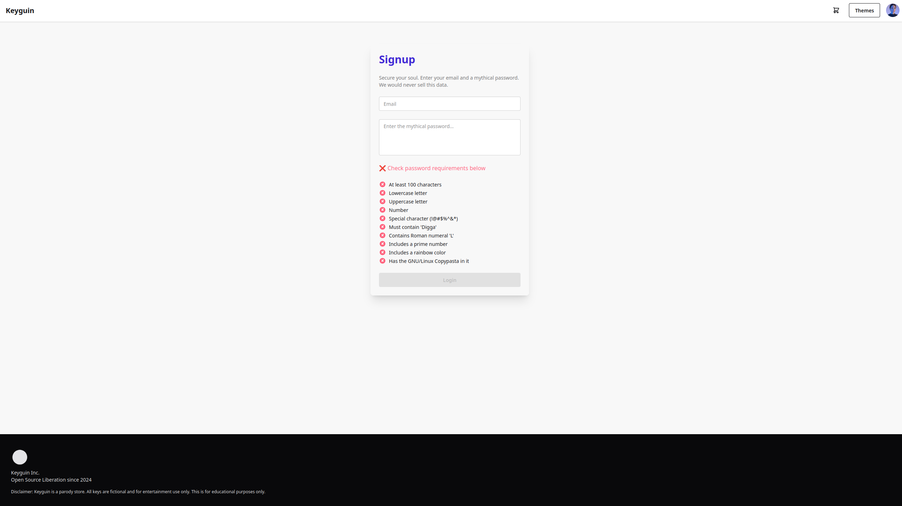
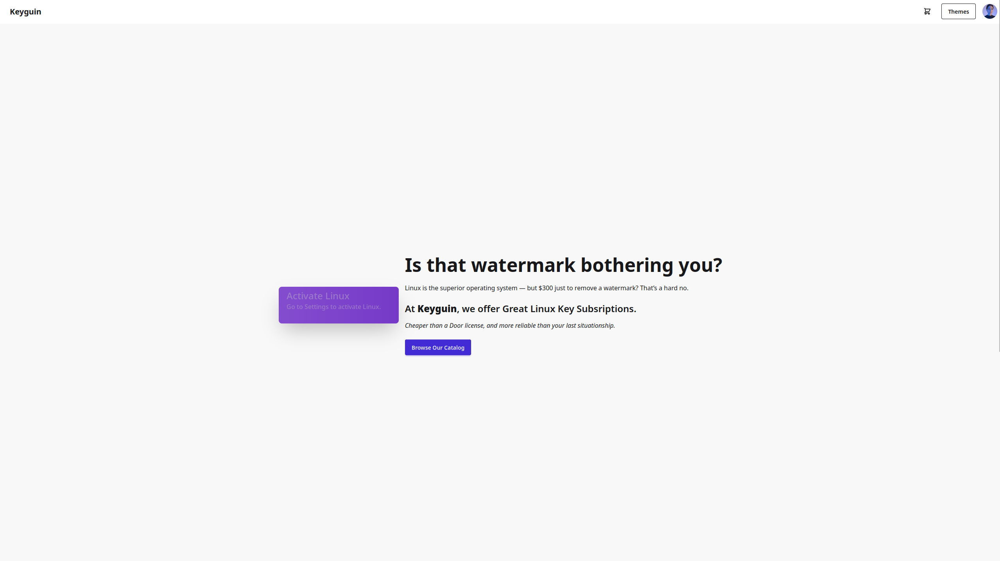
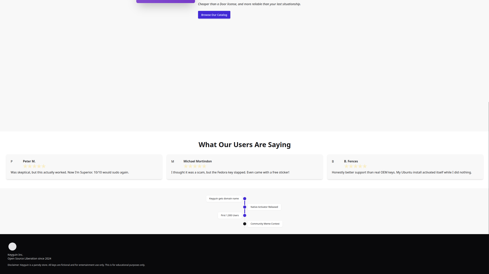
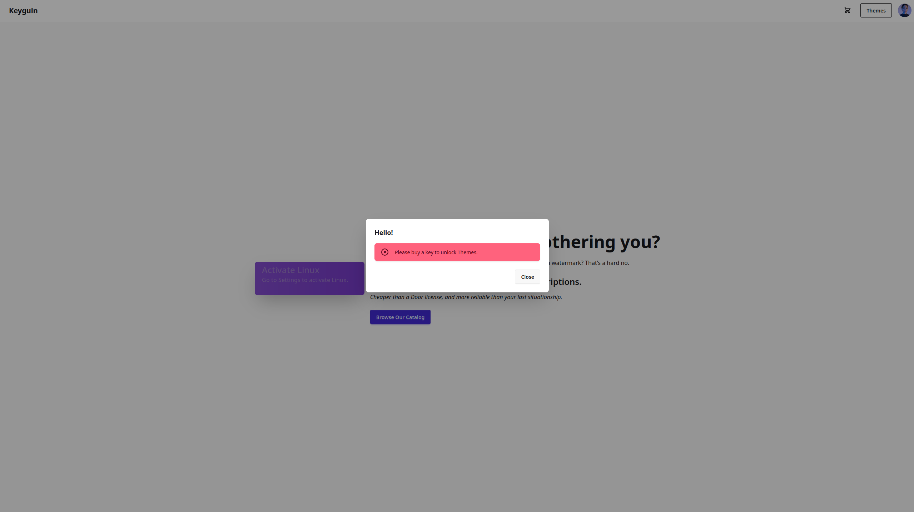
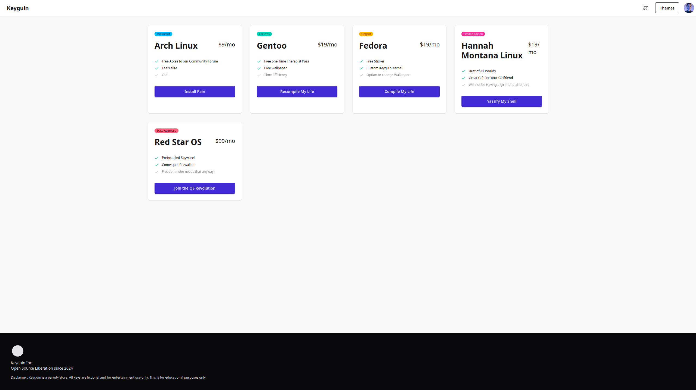

# 🐧 Keyguin — A Parody Key Store

Keyguin is a parody digital storefront built with [SvelteKit](https://kit.svelte.dev), styled using [Tailwind CSS](https://tailwindcss.com) and [DaisyUI](https://daisyui.com).  
This is just for educational purposes—feel free to use this as a template.

---

## 📸 Preview

Here’s a quick look at what Keyguin looks like in action:

|  |  |
|---------------------|---------------------|
|  |  |
|      Centerpiece     |
|   |

---

## 🚀 Getting Started

Clone the repo or create your own using `sv`:

```bash
# Create a new project in the current directory
npx sv create

# Or create a new project in a folder named "keyguin"
npx sv create keyguin
```

Then install dependencies:

```bash
npm install
```

---

## 🧪 Developing Locally

Spin up a local dev server with hot module reload:

```bash
npm run dev
```

Or automatically open in your browser:

```bash
npm run dev -- --open
```

---

## 🏗 Production Build

Build your production-ready app:

```bash
npm run build
```

To preview the final build locally:

```bash
npm run preview
```

---

##  UI & Styling

Keyguin uses **Tailwind CSS** and **DaisyUI** to make the UI delightful and component-rich.

DaisyUI gives you easy access to styled components out of the box:

```html
<button class="btn btn-secondary">Buy Key</button>
```

Check out [DaisyUI docs](https://daisyui.com/components/) for full component usage and theming.

---

##  Deployment

To deploy Keyguin, install the appropriate [SvelteKit adapter](https://kit.svelte.dev/docs/adapters) for your platform:

```bash
npm install -D @sveltejs/adapter-static
```

Update your `svelte.config.js`:

```js
import adapter from '@sveltejs/adapter-static';

export default {
  kit: {
    adapter: adapter()
  }
};
```

---

## 🧊 Project Stack

- **Framework:** [SvelteKit](https://kit.svelte.dev)
- **CLI:** [`sv`](https://github.com/sveltejs/cli)
- **CSS:** [Tailwind CSS](https://tailwindcss.com)
- **UI:** [DaisyUI](https://daisyui.com)

---

## 📄 License

MIT — parody project for educational and entertainment purposes only.
```

